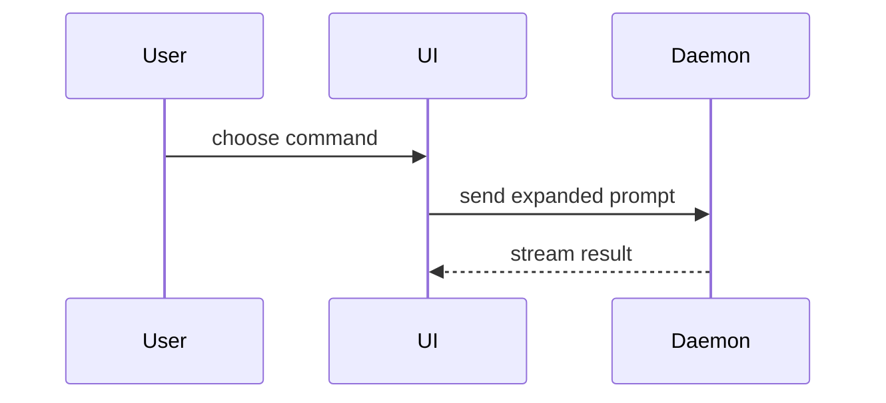

The pull request body is for the person who reviews the work: what they need and cannot cheaply get from the spec or the diff. Use these headings, in this order, and leave out one with nothing to say:

```markdown
## Start here

## Summary

## Evidence

## Where the ticket didn't decide

## Not verified

## Merge danger

## Recipe
```

One or two lines an item, and the whole body on one screen, apart from a Summary visual. The diff already shows what changed and the checks show what passed, so the body carries neither, nor a rating of the work. Skip all preambles. Use the domain language from `GLOSSARY.md`.

## Sections

### Start here

Where to start reading the diff, as `path:line`, and one line on where the behaviour lives. Always present.

### Summary

The shape of the change, when the diff alone doesn't show it: a change spread across files, a new control flow, a moved responsibility. Leave it out when Start here already makes the shape plain. Pick the smallest view that makes the key point clear.

- Show logic or an algorithm as pseudocode:

```text
on(save)
  if content is unchanged
    return cached result
  write new content
  return fresh result
```

- Show runtime control flow as a call tree:

```text
submitForm
  createSession
    persistPrompt
    launchAgent
  navigateToSession
```

- Show UI structure as a component tree, including state and module boundaries that matter:

```text
<SessionPage> (apps/example/src/routes/session.tsx)
  useSessionEvents()
  <SessionToolbar>
    <RunSkillButton> (packages/ui)
```

- Show file responsibility or a broad refactor as a shallow file tree:

```text
src/
├── commands/       # parses user actions
├── sessions/       # owns session state
└── transport/      # sends API requests
```

- Show component interaction, control flow, or data flow with Mermaid:



- Use `diff` when the point is what changes and the surrounding shape already exists. Match the diff shape to the topic.

For a component change:

```diff
 <SessionPage>
   useSessionEvents()
   <SessionToolbar>
+    <RunSkillButton />
   <SessionTimeline>
+    <SkillResultCard />
```

For a file-layout change:

```diff
 src/
 ├── commands/
+│   └── show-me.ts       # expands the slash command
 ├── sessions/
-└── transport.ts
+└── transport/
+    ├── client.ts
+    └── stream.ts
```

For a call-tree or call-stack change:

```diff
 submitForm
   createSession
     persistPrompt
+    expandSkillMention
     launchAgent
-  navigateToSession
+  navigateToSession
+    subscribeToEvents
```

For a state or control-flow change:

```diff
 on(save)
-  write content
+  if content is unchanged
+    return cached result
+  write new content
+  invalidate cache
```

- Show the whole block when most of it is new, when omitted context would hide ownership or order, or when the user needs a copyable target shape:

```ts
function expandSkill(command: string): string {
    const skillName = command.slice(1);
    return `use the ${skillName} skill`;
}
```

#### Guidance

Place each visual next to the short text it supports. Keep only the calls, files, props, states, and boundaries needed to answer the user's current question or the options to resolve the current discussion point.

You may use one of these, you may use several, it is unlikely you will use all of them. Use your judgement and don't overwhelm the user.

### Evidence

Before and after for behaviour the checks don't show: a screenshot of a visual change, or the output of a run the checks don't make. A screenshot is the strongest evidence where the environment is set up for one and the change is visual. A test the checks already run is not evidence here.

### Where the ticket didn't decide

Choices you made where the spec was silent, including each one made because nobody was there to ask, and any that bears on security. List too each choice the ticket marked the implementer's, with the answer you took, and each gap the user or the request settled, with its answer.

### Not verified

What you could not check, and behaviour the diff cannot show, such as what only a run on the host would. Carry over each check in the ticket's After merge. An acceptance criterion listed here keeps the ticket open: refer to the ticket without a closing keyword such as `Closes`.

### Merge danger

```markdown
**Door:** <one-way or two-way>

<optional: why>

**Blast radius:** <one word>

<optional: what a merge could break>
```

A two-way door can be walked back through: a change that is cheap to roll back is lower risk. A change that destroys data, or makes a hard-to-reverse decision, is a one-way door. The blast radius is everything the change could reach if it is wrong: consumers it breaks, data it touches, layout it shifts. Consider every possibility before naming it.

### Recipe

Only for work that is one large, mechanical change: the command or transformation rule that makes it, and where the diff departs from it.
